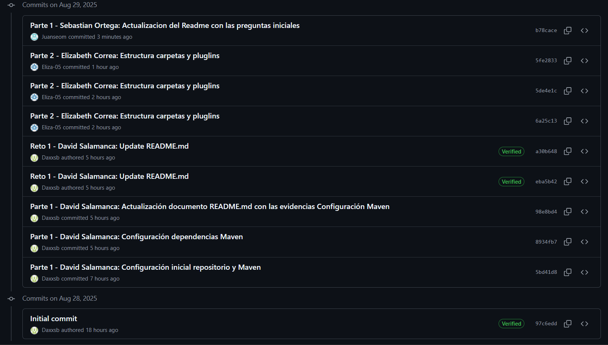

# Laboratorio-3-DOSW-02

**Integrantes**
- David Eduardo Salamanca Aguilar
- Elizabeth Correa Suarez
- Juan Sebastían Ortega Muñoz

**Nombre del repositorio**
'Laboratorio-3-DOSW_Salamanca-Correa-Ortega'

**Nombre de la rama:**
'feature/lab3_Salamanca_Correa_Ortega_2025-2'

---

## Retos Completados

# Reto 1 - Identificando los Requerimientos

A partir de la lectura del caso fintech su misión es:
    
•	Identifiquen reglas de negocio.

•	Definan las funcionalidades principales.

•	Escriban los actores principales.

•	Documenten las precondiciones necesarias para el sistema.

### Reglas de negocio

o	Los números de cuenta deben tener exactamente 10 dígitos

o	Los dos primeros dígitos corresponden a un banco registrado

o	Las cuentas no deben contener letras ni caracteres especiales

o	Cada cuenta debe estar asociada a un cliente único

### funcionalidades principales

o	Crear una cuenta bancaria válida

o	Validar número de cuenta según las reglas

o	Consultar el saldo de una cuenta

o	Realizar depósitos en una cuenta existente

###  Actores principales

•   Cliente : Crea cuenta, consulta saldo, deposita dinero

•	Sistema Bankify: Valida las reglas de negocio y guarda cuentas

•	Banco externo : El banco establece las reglas sobre con qué números puede empezar una cuenta

### Precondiciones necesarias para el sistema

•	Tener definido el listado de bancos válidos.

•	El sistema debe verificar que la cuenta no exista.

•	Reglas de negocio

# RETO #3: Una estimacion automatizada

## 1) Requerimientos
El sistema debe permitir realizar votaciones para estimar historias de usuario usando la técnica de Planning Poker.
Solo se aceptan los siguientes números al votar: 1, 2, 3, 5, 8, 13.
Si se ingresa un número diferente, se muestra un mensaje de error y se solicita el voto nuevamente.

## 2) ¿Cómo funciona el código?
El programa muestra las historias de usuario a estimar.
Cada integrante vota usando la secuencia permitida.
Si todos los votos son iguales, se alcanza un acuerdo y se asigna el puntaje final a la historia.
Si los votos son diferentes, se solicita discutir y volver a votar hasta lograr consenso.

## 3) Patrones y Principios Utilizados

- Principio de Responsabilidad Única (SRP): Cada clase tiene una única responsabilidad (HistoriaUsuario, Integrante, Votacion, PlanningPoker).
- Encapsulamiento: La lógica de votación y validación está encapsulada en la clase Votacion.
- Separación de Concerns: El flujo principal está en PlanningPoker, la representación de historias en HistoriaUsuario, y los integrantes en Integrante.
- Facilidad de extensión y mantenimiento: La estructura permite agregar nuevas funcionalidades sin afectar el resto del sistema.

## 4) Evidencias

---

## Historial de Commits

