# Laboratorio-3-DOSW-02

**Integrantes**
- David Eduardo Salamanca Aguilar
- Elizabeth Correa Suarez
- Juan Sebastían Ortega Muñoz

**Nombre del repositorio**
'Laboratorio-3-DOSW_Salamanca-Correa-Ortega'

**Nombre de la rama:**
'feature/lab3_Salamanca_Correa_Ortega_2025-2'

---

## Retos Completados


# Reto 1 - Identificando los Requerimientos

A partir de la lectura del caso fintech su misión es:
    
•	Identifiquen reglas de negocio.

•	Definan las funcionalidades principales.

•	Escriban los actores principales.

•	Documenten las precondiciones necesarias para el sistema.

### Reglas de negocio

o	Los números de cuenta deben tener exactamente 10 dígitos

o	Los dos primeros dígitos corresponden a un banco registrado

o	Las cuentas no deben contener letras ni caracteres especiales

o	Cada cuenta debe estar asociada a un cliente único


### funcionalidades principales

o	Crear una cuenta bancaria válida

o	Validar número de cuenta según las reglas

o	Consultar el saldo de una cuenta

o	Realizar depósitos en una cuenta existente


###  Actores principales

•   Cliente : Crea cuenta, consulta saldo, deposita dinero

•	Sistema Bankify: Valida las reglas de negocio y guarda cuentas

•	Banco externo : El banco establece las reglas sobre con qué números puede empezar una cuenta

### Precondiciones necesarias para el sistema

•	Tener definido el listado de bancos válidos.

•	El sistema debe verificar que la cuenta no exista.

•	Reglas de negocio

## RETO #2: Diseñando

--- 

### Historias de Usuario

-	**COMO** Cliente **QUIERO** crear una cuenta válida **PARA** poder ahorrar.
-	**COMO** Cliente **QUIERO** consultar mi saldo en la cuenta **PARA** saber cuánto dinero tengo disponible.
-	**COMO** Cliente **QUIERO** depositar dinero **PARA** aumentar el saldo de mi cuenta.
-	**COMO** Bankify **QUIERO** validar la integridad **PARA** mantener el estandar PCI.


# RETO #3: Una estimacion automatizada

## 1) Requerimientos
El sistema debe permitir realizar votaciones para estimar historias de usuario usando la técnica de Planning Poker.
Solo se aceptan los siguientes números al votar: 1, 2, 3, 5, 8, 13.
Si se ingresa un número diferente, se muestra un mensaje de error y se solicita el voto nuevamente.


## 2) ¿Cómo funciona el código?
El programa muestra las historias de usuario a estimar.
Cada integrante vota usando la secuencia permitida.
Si todos los votos son iguales, se alcanza un acuerdo y se asigna el puntaje final a la historia.
Si los votos son diferentes, se solicita discutir y volver a votar hasta lograr consenso.


## 3) Patrones y Principios Utilizados

- Principio de Responsabilidad Única (SRP): Cada clase tiene una única responsabilidad (HistoriaUsuario, Integrante, Votacion, PlanningPoker).
- Encapsulamiento: La lógica de votación y validación está encapsulada en la clase Votacion.
- Separación de Concerns: El flujo principal está en PlanningPoker, la representación de historias en HistoriaUsuario, y los integrantes en Integrante.
- Facilidad de extensión y mantenimiento: La estructura permite agregar nuevas funcionalidades sin afectar el resto del sistema.


## 4) Evidencias

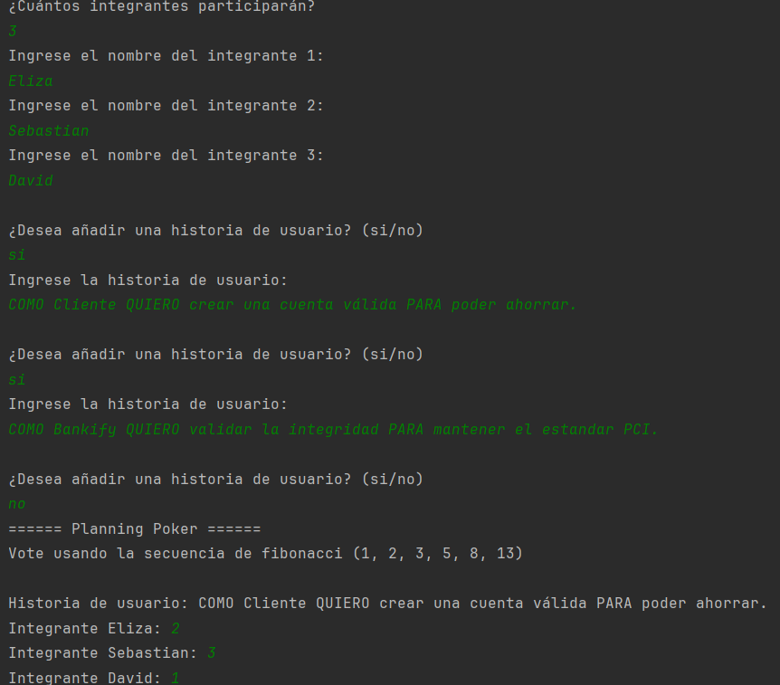
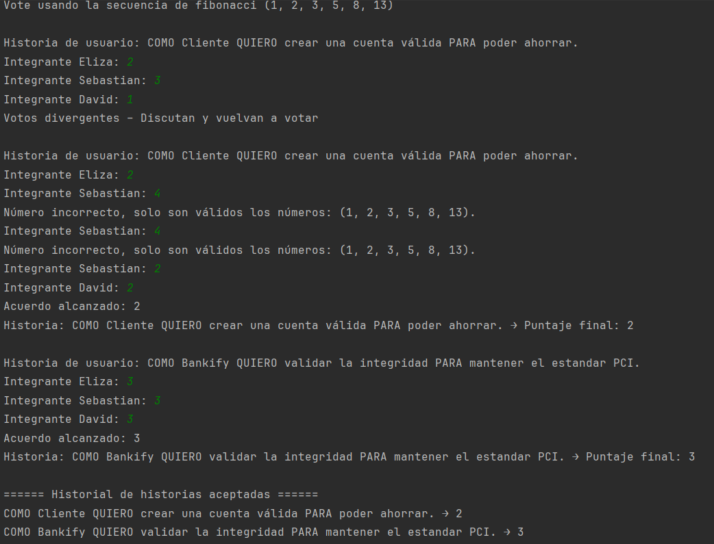
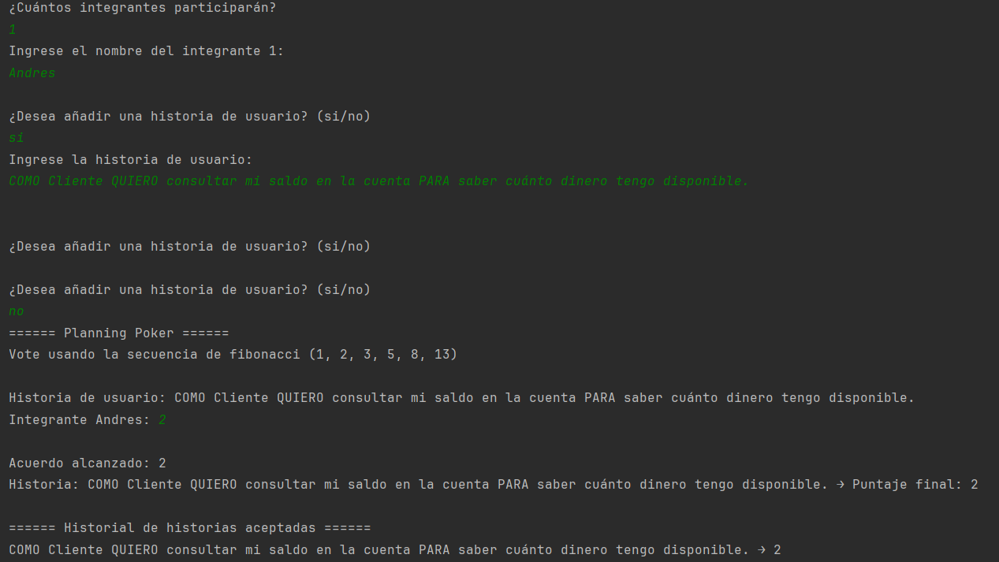


---

# 💻 RETO #4: Tiempo De Desarrollo

## Enunciado
En este reto se implementó la clase **`ValidadorCuenta`**, **`CuentaBancaria`**, **`AdministradorCuenta`** y **`Movimiento`** aplicando la metodología **TDD (Test Driven Development)**.  

El proceso seguido fue:

1. Crear pruebas unitarias con **JUnit 5**.  
2. Implementar la clase de validación en una primera versión (Etapa 1).  
3. Ejecutar las pruebas y confirmar que pasaran.  
4. Realizar un **refactor** para mejorar el código (Etapa 2).  
5. Verificar nuevamente que las pruebas siguieran pasando.  

---


> ## 🔹 CLASE VALIDADOR CUENTA

## 🧪💻 Pruebas diseñadas

Se definieron distintos casos para cubrir las reglas de negocio de las cuentas:

- **Formato válido:** cuentas con 10 dígitos (`0123456789`, `0200000000`).  
- **Formato inválido:** vacías, con espacios, menos/más de 10 dígitos, letras o símbolos (`12345`, `01A2345678`, `00123456789`).  
- **Nulos:** entradas `null` o `""` siempre inválidas.  
- **Banco válido:** prefijos registrados `01`, `02` (`0112345678`, `0211111111`).  
- **Banco inválido:** prefijos no registrados (`00`, `09`, `99`).  
- **Validación integral:** combina ambas reglas → ejemplos válidos (`0112345678`) e inválidos (`9912345678`, `012345678`).

## 🔴 Ejecución inicial de pruebas
Antes de implementar la lógica, las pruebas fallaban ya que no se tenia la implementacion de los metodos

**Evidencia:**  
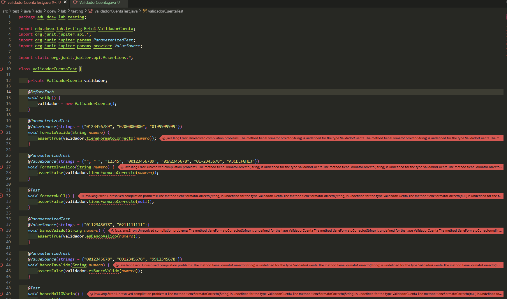

---

## 📌 Implementación (Etapa 1)
Se implementó una primera versión de la clase **`ValidadorCuenta`**, con bucles tradicionales y validaciones básicas.

## ✅ Ejecución de pruebas Despues de la implementación
Con la implementación de la Etapa 1, las pruebas pasan exitosamente.

**Evidencia:**  
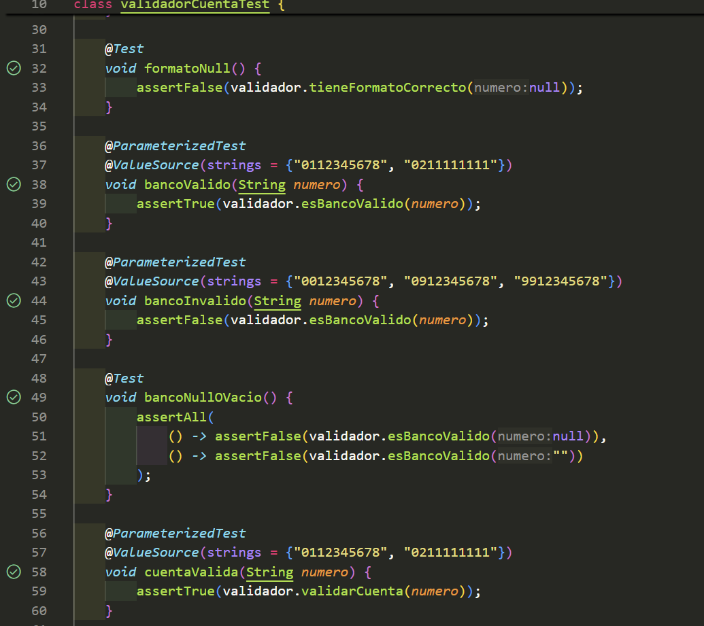
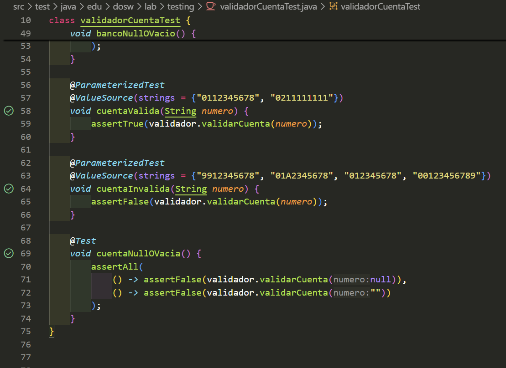

## ⚙️📌 Refactor (Etapa 2)
Se mejoró el código aplicando Streams y Lambdas:

- Uso de chars().allMatch(...) para verificar que todos los caracteres sean dígitos.

- Uso de Set<String> con los prefijos de bancos registrados para hacer la validación más eficiente.

## 🔧✅ Ejecución de pruebas despues del refactor
Después del refactor, todas las pruebas se ejecutan correctamente sin romper la funcionalidad.

**Evidencia:**  
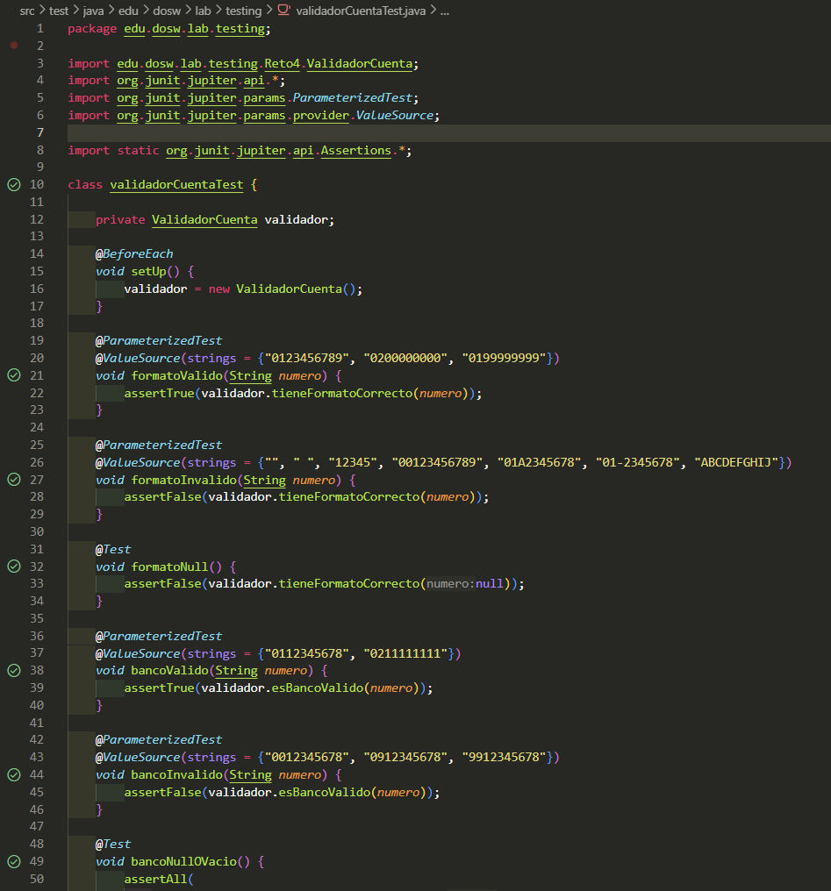
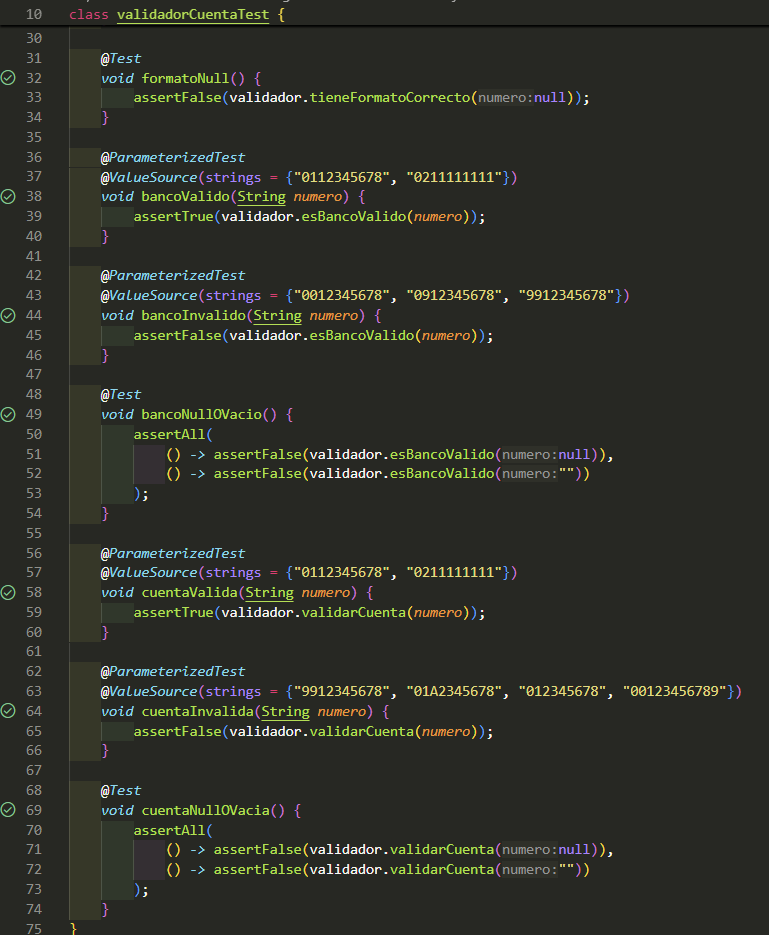


> ## 🔹 CLASE CUENTA BANCARIA

## 🧪💻 Pruebas diseñadas

Se definieron distintos casos para cubrir las reglas de negocio de las cuentas:

- **Saldo inicial:** al crear una cuenta, el saldo debe ser `0.0`.  
- **Depósito válido:** al depositar un monto positivo, el saldo aumenta y se registra un movimiento con monto, fecha y número de cuenta.  
- **Depósito inválido:** al intentar depositar `0` o un valor negativo, se lanza una excepción (`IllegalArgumentException`).  

## 🔴 Ejecución inicial de pruebas
Antes de implementar la lógica, las pruebas fallaban ya que no se tenia la implementacion de los metodos

**Evidencia:**  
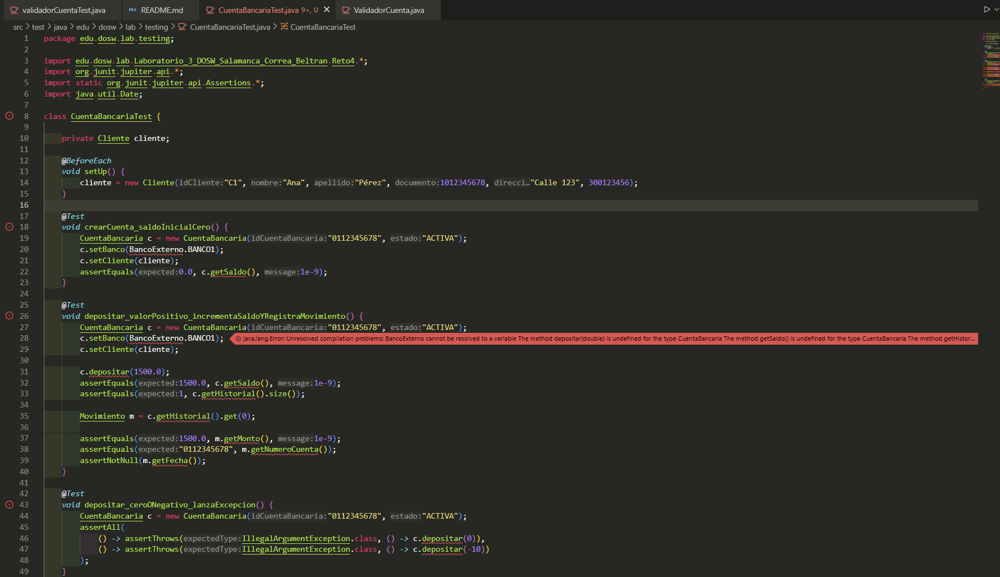

---

## 📌 Implementación (Etapa 1)
Se implementó una primera versión de la clase **`CuentaBancaria`**, con un atributo de saldo y un historial básico de movimientos.

## ✅ Ejecución de pruebas después de la implementación
Con la implementación de la Etapa 1, las pruebas pasan exitosamente.

**Evidencia:**  
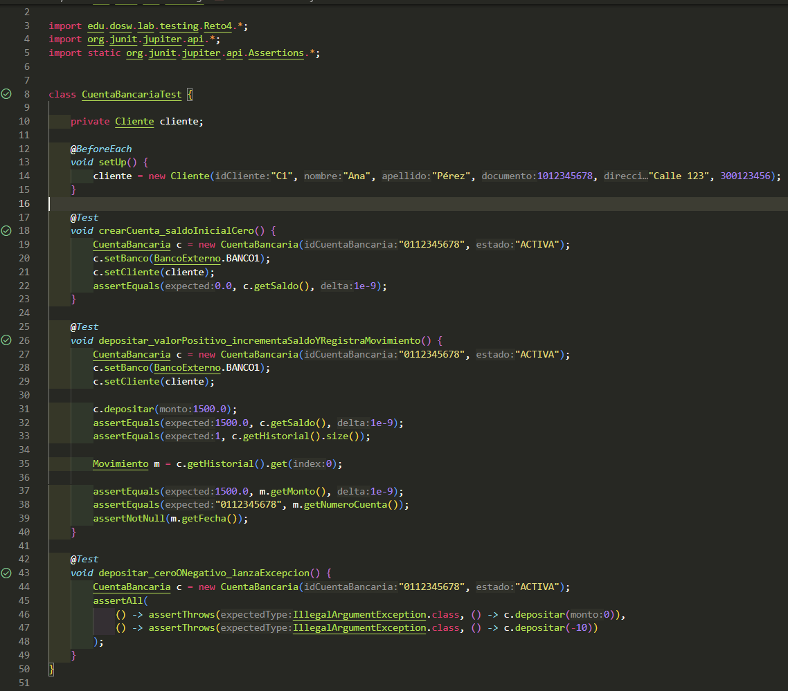


## ⚙️📌 Refactor (Etapa 2)
Se mejoró el código aplicando prácticas de inmutabilidad y listas no modificables para el historial, además de simplificar la lógica del depósito.

## 🔧✅ Ejecución de pruebas después del refactor
Después del refactor, todas las pruebas se ejecutan correctamente sin romper la funcionalidad.

**Evidencia:**  

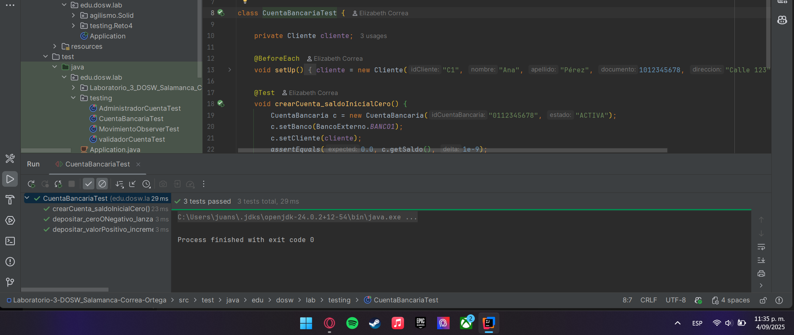


> ## 🔹 CLASE ADMINISTRADOR CUENTA

## 🧪💻 Pruebas diseñadas

Se definieron distintos casos para cubrir las reglas de negocio de las cuentas:

- **Crear cuenta válida:** se puede crear una cuenta con número correcto, asociarla a un cliente y consultar saldo inicial `0.0`.  
- **Crear cuenta inválida:** si el número no cumple las reglas, se lanza una excepción.  
- **Depositar desde administrador:** el administrador permite hacer un depósito, lo que incrementa el saldo y guarda un movimiento en el historial.  

## 🔴 Ejecución inicial de pruebas
Antes de implementar la lógica, las pruebas fallaban ya que no se tenia la implementacion de los metodos

**Evidencia:**  
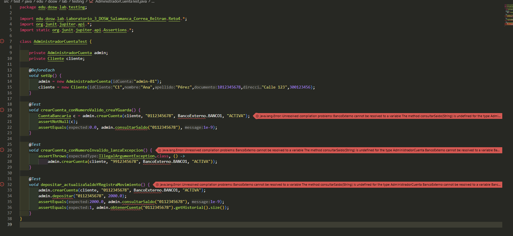

---

## 📌 Implementación (Etapa 1)
Se implementó una primera versión de la clase **`AdministradorCuenta`**, con un mapa interno para almacenar cuentas y un validador para los números de cuenta.

## ✅ Ejecución de pruebas después de la implementación
Con la implementación de la Etapa 1, las pruebas pasan exitosamente.

**Evidencia:**  
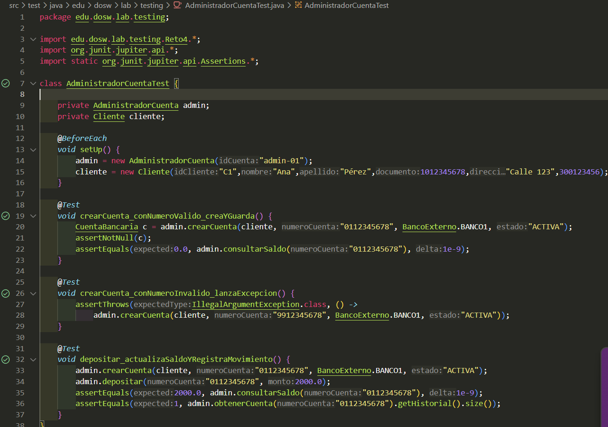

## ⚙️📌 Refactor (Etapa 2)
Se optimizó el manejo de cuentas usando `Objects.requireNonNull`, validaciones más claras y mejor organización interna del código.

## 🔧✅ Ejecución de pruebas después del refactor
Después del refactor, todas las pruebas se ejecutan correctamente sin romper la funcionalidad.

**Evidencia:**  

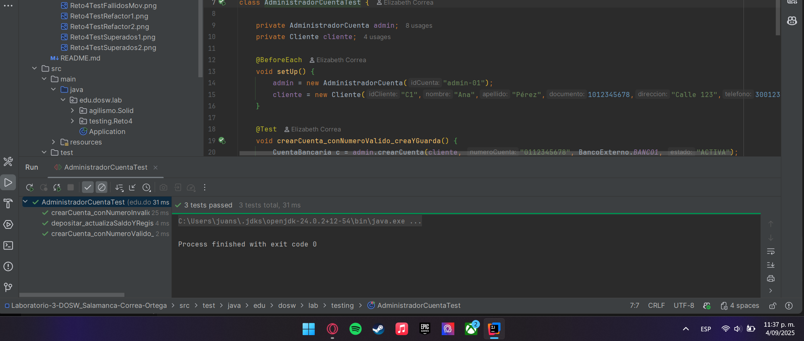


> ## 🔹 CLASE MOVIMIENTO

## 🧪💻 Pruebas diseñadas

Se definieron distintos casos para cubrir las reglas de negocio de las cuentas:

- **Notificación de movimiento:** cuando un `Movimiento` cambia su monto y tiene al `AdministradorCuenta` como observador, se notifica y el saldo de la cuenta correspondiente se actualiza correctamente.   

## 🔴 Ejecución inicial de pruebas
Antes de implementar la lógica, las pruebas fallaban ya que no se tenia la implementacion de los metodos

**Evidencia:**  
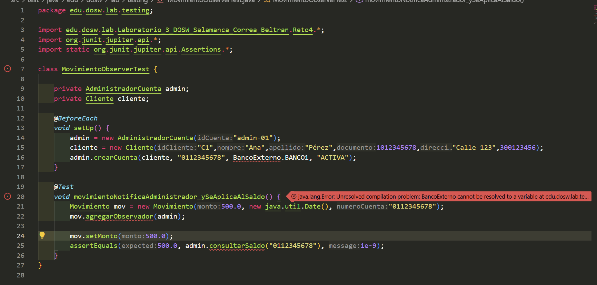

---

## 📌 Implementación (Etapa 1)
Se implementó la clase **`Movimiento`** como sujeto con lista de observadores, y la clase **`AdministradorCuenta`** como observador que reacciona al recibir notificaciones.

## ✅ Ejecución de pruebas después de la implementación
Con la implementación de la Etapa 1, las pruebas pasan exitosamente.

**Evidencia:**  
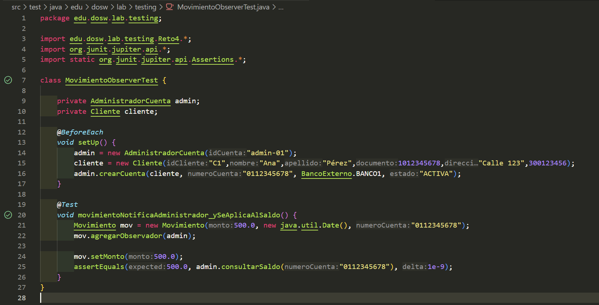

## ⚙️📌 Refactor (Etapa 2)
Se mejoró el código aplicando uso de `Streams` para notificar observadores, validación con `Objects.requireNonNull` y mayor encapsulamiento de atributos.

## 🔧✅ Ejecución de pruebas después del refactor
Después del refactor, todas las pruebas se ejecutan correctamente sin romper la funcionalidad.

**Evidencia:**  

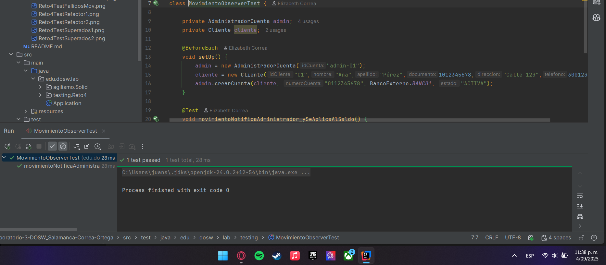

### 🧩PATRON DE DISEÑO UTILIZADO

Se utilizó el patrón de diseño **Observer** para gestionar la relación entre `Movimiento` y `AdministradorCuenta` porque permite que cada vez que ocurre un cambio en un movimiento (por ejemplo, un depósito) se notifique automáticamente al administrador, garantizando que el saldo de la cuenta se mantenga siempre actualizado sin necesidad de acoplar directamente ambas clases; de esta manera se logra un sistema más flexible, fácil de mantener y preparado para futuras extensiones, como agregar otros observadores que reaccionen a los movimientos (auditorías, notificaciones, reportes) sin modificar la lógica principal.


# 🧩 Reto #5 – JaCoCo (Cobertura ≥ 85%)

**Objetivo:** Configurar JaCoCo, generar el reporte de cobertura y elevar la cobertura de pruebas hasta **≥ 85%** (instrucciones y ramas).

### 🔧 Configuración
- Se configuró `jacoco-maven-plugin` con metas `prepare-agent`, `report` y `check (≥85%)`.
- Ejecutar: `mvn clean verify` (genera `target/site/jacoco/index.html` y aplica la regla de cobertura mínima).

### 📊 Cobertura inicial
Al inicio nos daba una cobertura del 80%, por tanto añadimos mas pruebas para superar el 85%

Evidencia:
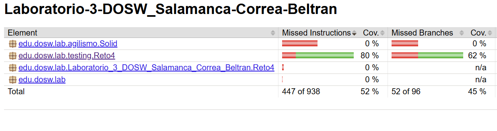

### ➕ Casos de prueba añadidos
- añadimos mas test en las clases: cliente, validadorCuenta, Banco externo y Bankify

### ✅ Cobertura final (≥ 85%)
Evidencia:
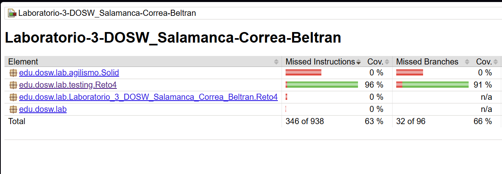

**Instrucciones:** ≥ 85%  
**Ramas:** ≥ 85%

### 📊 Dificultades con la cobertura

Tuvimos dificultades al analizar la cobertura con **JaCoCo**, ya que en el reporte se mostraba un porcentaje bajo de manera general. Esto se debía a que se estaban teniendo en cuenta otras ramas del proyecto que no correspondían al **Reto 4**, lo cual hacía que el promedio global bajara.  

Sin embargo, al enfocarnos únicamente en las clases y pruebas correspondientes al **Reto 4**, logramos cumplir con la condición de tener una cobertura **superior al 85%**, garantizando así la calidad del código desarrollado en este reto.


### ✍️ Reflexión

Para mejorar la cobertura fue necesario añadir casos de prueba que validaran tanto los **escenarios felices** como los **escenarios de error**. En particular, se incluyeron pruebas que verifican la creación de objetos con valores inválidos (nulos, vacíos o negativos), el correcto funcionamiento de los setters, así como la ejecución de métodos especiales como `toString`, `equals` y `hashCode`.  

Este proceso permitió cubrir ramas del código que inicialmente no se ejecutaban en los tests básicos, asegurando que todas las validaciones y condiciones fueran comprobadas. La métrica de cobertura es importante porque no solo indica cuánta parte del código ha sido probada, sino que ayuda a detectar posibles fallos antes de que lleguen a producción, generando así un software más **confiable, robusto y mantenible**.

---
# Reto #6 – SonarQube
---


## 📌 Descripción
En este reto se realizó el análisis estático de código utilizando **SonarQube** con Docker y su integración en el proyecto Maven.  


## ⚙️ Pasos realizados

1. Descarga e instalación de Docker Desktop.
2. Descarga y ejecución del contenedor de SonarQube:
   ```bash
   docker pull sonarqube
   docker run -d --name sonarqube -e SONAR_ES_BOOTSTRAP_CHECKS_DISABLE=true -p 9000:9000 sonarqube:latest

3. Acceso a la interfaz web de SonarQube en http://localhost:9000
4. Cambio de credenciales iniciales (admin/admin).
5. Generación de un token de acceso para Maven.
6. Configuración del pom.xml con los plugins de SonarQube y Jacoco.
7. Ejecución del análisis con:
    ```bash
   mvn verify sonar:sonar -Dsonar.token=[TOKEN_GENERADO]
8. Validación del análisis desde la interfaz de SonarQube.

# 📸 Evidencias

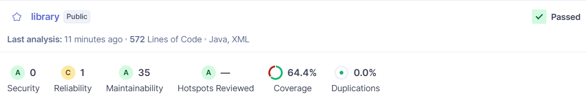


## Reflexiones del equipo

### Sebastian Ortega

Considero que es importante realizar pruebas a un software diseñado porque permiten detectar errores antes de que lleguen al usuario final. Esto ahorra costos, mejora la calidad del producto y genera mayor confianza en el equipo de desarrollo.

### Elizabeth Correa

Las pruebas son fundamentales porque ayudan a verificar que el sistema cumple con los requisitos y que funciona en diferentes escenarios. Sin pruebas, el software puede fallar en producción y afectar la experiencia de los usuarios.

### David Salamanca

Para mí, hacer pruebas es clave porque asegura la mantenibilidad del proyecto. Un software sin pruebas se vuelve riesgoso de modificar, mientras que con pruebas automatizadas es más sencillo garantizar la estabilidad del sistema.