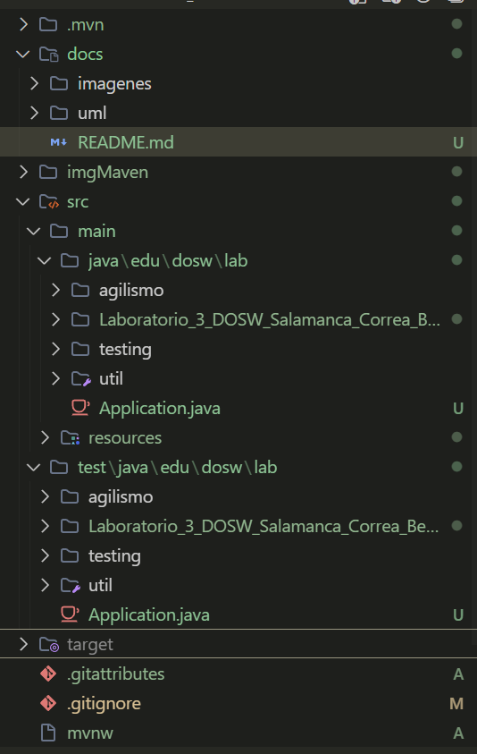
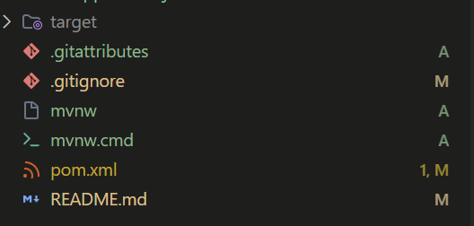
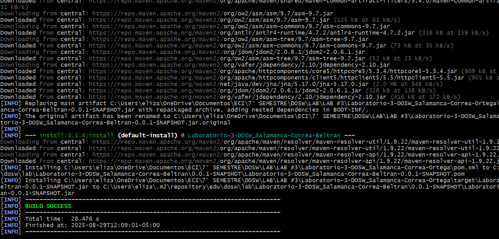

# Laboratorio-3-DOSW-02

**Integrantes**
- David Eduardo Salamanca Aguilar
- Elizabeth Correa Suarez
- Juan Sebastían Ortega Muñoz

**Nombre del repositorio**
'Laboratorio-3-DOSW_Salamanca-Correa-Ortega'

**Nombre de la rama:**
'feature/lab3_Salamanca_Correa_Ortega_2025-2'

---

## Retos Completados

### Parte 1
#### Primer Integrante
1. Configuración MAVEN
    
    A continuación las capturas donde se evidencia la implementación de las dependencias
    y la prueba de debug y ejecución.
    
    
    
    
    
    
    

#### Segundo integrante
1. Estructura de carpetas
    
    

2. Dependencias y pluggins
    

  

